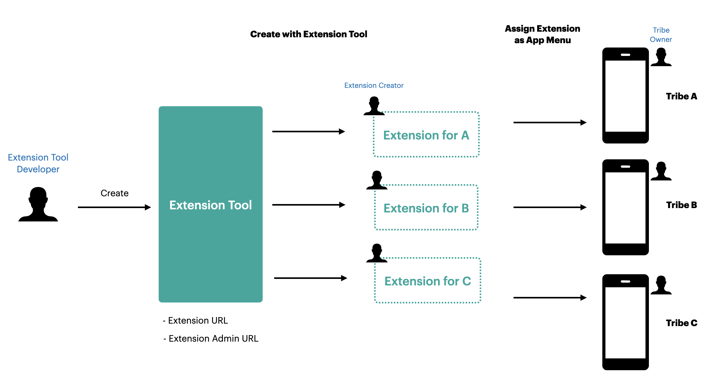
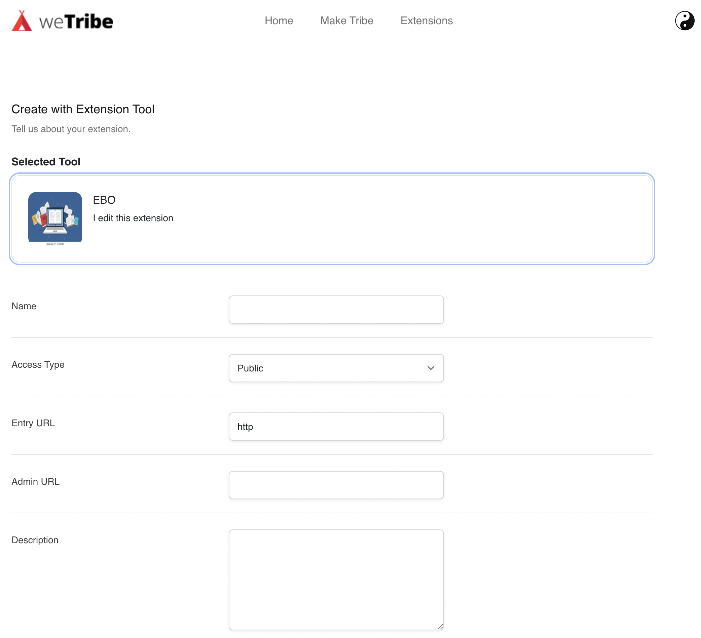
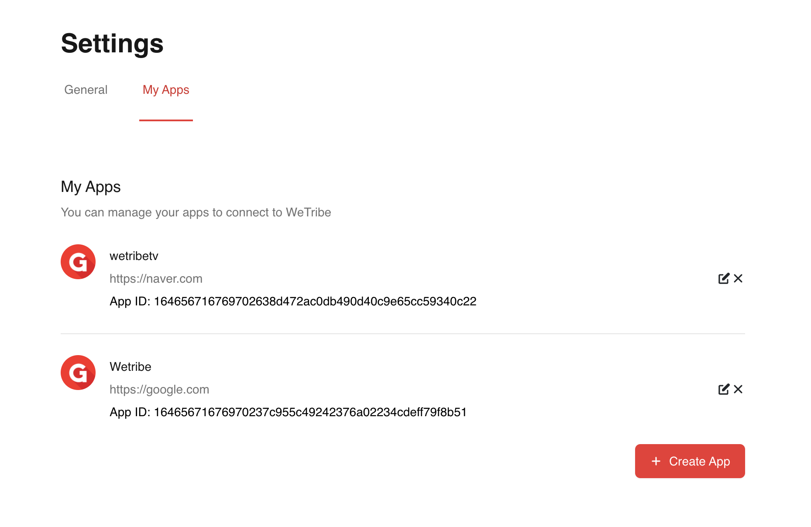

# Guide for Extension Tool Developer

This document explains how extension tool developer can make their own extension tools and help to get better understanding on ecosystem of wetribe.



In our Wetribe Extension system, **Extension Tool Developer** can create an extension tool that can produce customized extensions with it. And an **Extension Creator** can create a extension with a extension tool. After the extension is being created, a **Tribe owner** who wants to create their own app, can assign one of extension as a menu.

## How to Guides

-   [How to Create an Extension Tool](#how-to-create-an-extension-tool)
-   [Using OAuth 2.0](#using-oauth-2.0)

Here are some glossaries for better understanding.

<b>Glossaries</b>

-   **Extension**: Extension is a plug-in based app and any tribe owner can apply it on their tribe.

-   **Extension Tool**: Extension Tool is a tool which is can be used create an extension for the own purpose of each tribe owner.

-   **Extension Tool Developer**: A Developer who creates Extension Tool.

-   **Extension Creator**: A User who creates extension with extension tool.

-   **Extension URL**: A URL of entry point of each extension.

-   **Extension Admin URL** : A URL for admin page of each Extension.

## How to Create an Extension Tool

### Prerequisite

-   **Extension URL** : Before you create your own service as an extension, single URL address than any user can access must be ready.

Ex) https://example.com/

-   **Extension Admin URL** : Admin page URL must be ready before you create as a tool. This page will be shown on Mobile App Settings Tab. To see more information about this, please see [this]().

### Step 1. Prepare the entry point to generate Extension URL

The Extension URL would be the entry point of extension on Webview when it is assigned as a menu.

Your extension tool must provide the unique entry point URL for each extension creator's demand.

For example, when the extension creator A wants to create extension with this tool, url like `http://yourapp.com/users/a` should be provided in your service.

### Step 2. Upload your Extension Tool

To upload your extension, these files are must be prepared: <br>

-   manifest.json

```
In Package root folder
|
|-- manifest.json (config file)
|
|-- (other files for production)
```

And this is an example for &nbsp;`manifest.json`:

```
{
    "domain": "com.wetribe.helloHTML",  // Extesnion Tool Domain name
    "version": "1.0.0",                 // Version Information
    "type": "url",                     // Extension Type
    "entry": "http://yourapp.com/entry",      // Entry point URL to create extension URL
    "covers": ["img/fire.png"], // Cover image file location
}
```

Detail properties of `manifest.json` would be documented soon. You can use this template for now.

<br>

If your extension tool package is ready, Please go to [Extension page](http://develop.wetribe.io/extension).

Follow these steps:

1. Click 'Create your extension'.
2. Write down your basic information of your extension tool.
3. On package, upload your <b>Packed Extension Zip</b>.

> If your extension was not packed, follow this instruction for the packing.

### How to Generate Extension URL


In your extension tool service, your extension tool service provide some features through the steps from 1 to 3.

### 1. Create as Extension

When extension creator clicks `Create as Extension` on the extension tool page, the browser will open new tab with your `Extension Tool Entry URL` in your manifest.json with some query paramters:

`http://EXT_TOOL_ENTRY_URL?extVersionId=VERSION_ID&domain=DOMAIN`

-   `extVersionId` - Extension Tool version ID.
-   `domain` - Extension domain on your manifest.json

you have to keep these params because these parameters should be passed on step 3.

### 2. Generate Extension URL

On this step, your service need to guide that user can get final `Extension URL` which would be the entry point of extension.

### 3. Continue to Create Extension

After the step 2, your extension tool service should open this URL with these params:

`http://develop.wetribe.io/extension/tools/create`

And the Query params would be :

-   `appURL` - Extension URL which is entry point of extension.
-   `extVesrionId` - Extension tool version ID (passed from wetribe)
-   `domain` - Extension domain on your manifest.json (passed from wetribe)



If you see this creation page properly, now it is good to go.

## Using OAuth 2.0

Wetribe uses OAuth 2.0's authorization code grant flow to issue access tokens on behalf of users.

You'll need to register your app before getting started. A registered app is assigned a unique Client ID and Client Secret which will be used in the OAuth flow.


### Step 1. Register your App

First, login to Wetribe and go to http://develop.wetribe.io/mainindex.



-   If you don't have your OAuth App, create one.
-   `Callback URL` is a URL to be redirected when user is authorized.
-   If you have your app on list, **copy the App ID and keep it** in .env or somewhere in your project folder.

<br>

### Step 2. Sending users to authorize

<br>

Your web or mobile app should redirect users to the following URL:

`http://develop.wetribe.io/login/oauth`

The following values should be passed as Query parameters:

-   `appId` - issued when you created your app (required)

### Step 3. Get token from the Response

After the authorization, you will be redirected to callback URL with json web token like:

```
http://YOUR_CALL_BACK_URL?jtoken=JSON_WEB_TOKEN

```

Paremeters would be:

-   `jtoken` : the issued json web token from service API. (Please store your user tokens with care.)

### Step 4. Call APIs using access tokens

The tokens awarded to your app can be used in requests to the Web API.

#### In a query string:

```
GET /napi/latest/auth/user/info/current?jtoken=YOUR_TOKEN
```

-   API base URL is `http://develop.wetribe.io` for now.

Example Response would be like this:

```
{
    "code": "000",
    "data": {
        "id": 2,
        "nickname": "harrykim",
        "desc": "harrykim",
        "thumb": "http://develop.wetribe.io/public/images/platform/avatar.jpg"
    }
}
```

-   `code` : The response code. `000`is success.
-   `id` : The unique id of eache user.
-   `nickname`: User's nickname
-   `desc` : User Description
-   `thumb` : User's thumbnail image URL.
