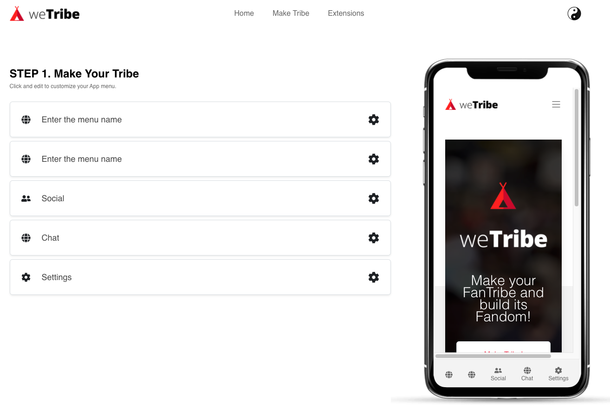
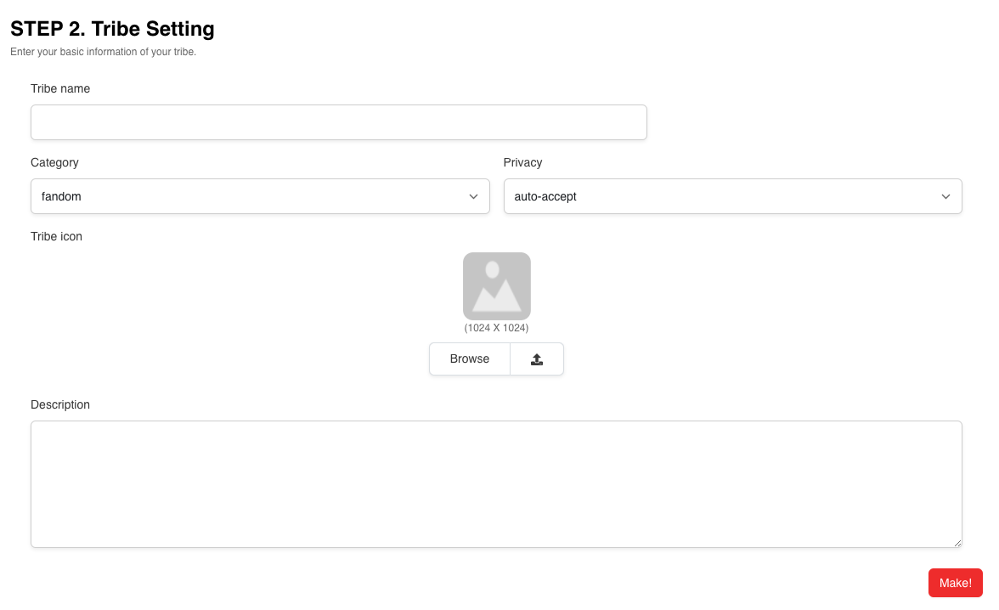
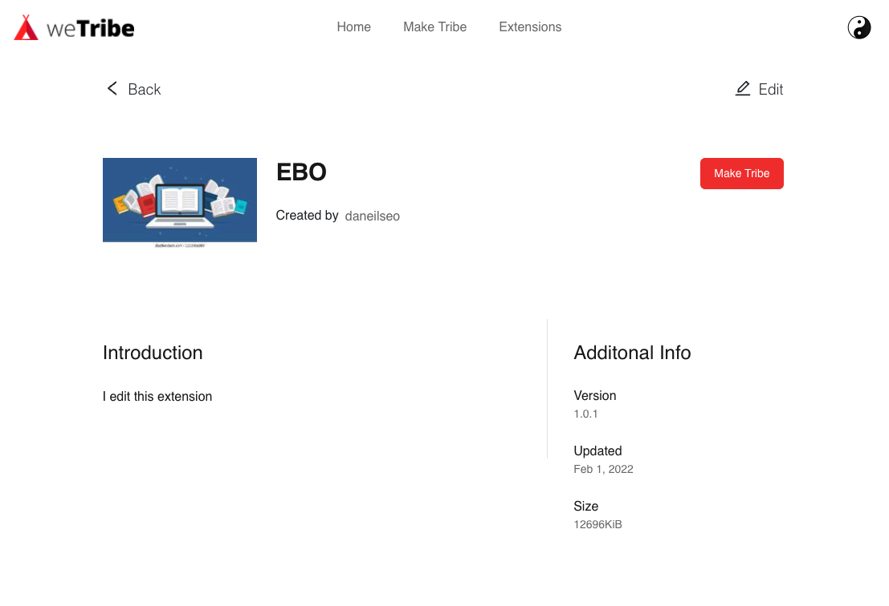

# Guide for Tribe Owner

This document explains how tribe owner can manage the tribe on wetribe.

Tribe owner can create or edit the tribe before deploying the apps through wetribe website.
On this page, you can learn these things:

-   [How to create a tribe](#how-to-create-a-tribe)
-   [How to create an extension with extension tools](#create-an-extension-with-extension-tools)

## How to create a tribe

If you want to be a tribe owner, you have to create a tribe beforehand. Here are the steps you have to follow:

1. [Sign in on Wetribe](#sign-in-on-wetribe)
2. [Select menus for the app.](#select-menus-for-the-app)
3. [Enter the basic info of your tribe.](#enter-the-tribe-info)
4. Finish

### Sign in on wetribe

Please go to [Login page](http://wetribe.us/login/login) on wetribe and make sure your account is logged in.

### Select menus for the app

If you are logged in, please go to [make tribe page](http://wetribe.us/make_tribe).

Then you can see the image above.

You can create the menu which is corresponding to one of the bottom navigation menu on mobile app.

### Enter the Tribe Info

After you select the menus for the app, please fill the form to finish the steps.
Here are the explanation of each properties of the form:

-   Tribe name : The name of tribe. This will be the app name too when it is deployed.
-   Category : The category of tribe belongs.
-   Privacy : The level of privacy when user try to joins the tribe.
-   Tribe icon : The icon of the tribe. Same as app icon.
-   Description : The short description of the tribe.

## Create an extension with extension tools

If you want to get an extension only for your tribe, you can create an extension with extension tools.

?> If you want to know more about extension tools, Please see this [page](#hi)

Here are some explanations to help you:

-   How to get an extension with extension tools
-   How to assign it as menu

### Get an extension with extension tools

First, please go to [extension tools page](http://wetribe.us/extension).

and select one of the tools you want to create.

Next, there would be the guideline page link on the description.
Follow the instructions and finish creating the extension.

### How to assign it as menu

If you are on deatil page of extension that you have created, you can see the 'make tribe' button on the right above.

You can click the button and the page will be redirected [make tribe page](http://wetribe.us/make_tribe).
